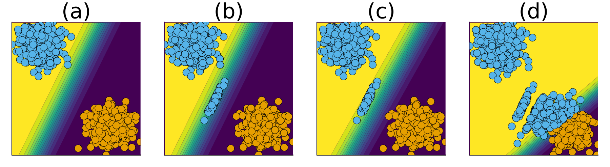
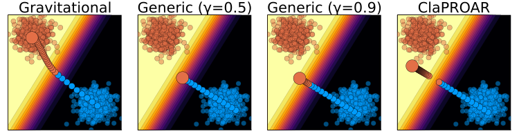

# Endogenous Macrodynamics in Algorithmic Recourse

This repository contains all code, notebooks, data and empirical results
for our conference paper “Endogenous Macrodynamics in Algorithmic
Recourse” (Altmeyer et al. 2023).

Below is a list of relevant resources hosted in this repository:

1.  [Paper](paper/paper.pdf) in this repo
2.  [Paper](https://openreview.net/pdf?id=-LFT2YicI9v) on OpenReview
3.  [Online
    Companion](https://www.paltmeyer.com/endogenous-macrodynamics-in-algorithmic-recourse/)
4.  [IEEE SaTML Presentation
    Slides](https://www.paltmeyer.com/content/talks/posts/2023-ieee-satml/presentation.html)
5.  [IEEE SaTML Poster](dev/poster/poster.pdf)
6.  Software:
    [`AlgorithmicRecourseDynamics.jl`](https://github.com/pat-alt/AlgorithmicRecourseDynamics.jl)
    and
    [`CounterfactualExplanations.jl`](https://github.com/pat-alt/CounterfactualExplanations.jl)

## Motivation

The chart below illustrates what we define as macrodynamics in
Algorithmic Recourse: (a) we have a simple linear classifier trained for
binary classification where samples from the negative class (*y* = 0)
are marked in orange and samples of the positive class (*y* = 1) are
marked in blue; (b) the implementation of AR for a random subset of
individuals leads to a noticeable domain shift; (c) as the classifier is
retrained we observe a corresponding model shift; (d) as this process is
repeated, the decision boundary moves away from the target class.



## Abstract

Existing work on Counterfactual Explanations (CE) and Algorithmic
Recourse (AR) has largely focused on single individuals in a static
environment: given some estimated model, the goal is to find valid
counterfactuals for an individual instance that fulfill various
desiderata. The ability of such counterfactuals to handle dynamics like
data and model drift remains a largely unexplored research challenge.
There has also been surprisingly little work on the related question of
how the actual implementation of recourse by one individual may affect
other individuals. Through this work, we aim to close that gap. We first
show that many of the existing methodologies can be collectively
described by a generalized framework. We then argue that the existing
framework does not account for a hidden external cost of recourse, that
only reveals itself when studying the endogenous dynamics of recourse at
the group level. Through simulation experiments involving various
state-of-the-art counterfactual generators and several benchmark
datasets, we generate large numbers of counterfactuals and study the
resulting domain and model shifts. We find that the induced shifts are
substantial enough to likely impede the applicability of Algorithmic
Recourse in some situations. Fortunately, we find various strategies to
mitigate these concerns. Our simulation framework for studying recourse
dynamics is fast and open-sourced.

## Key Findings

- Our findings indicate that state-of-the-art approaches to Algorithmic
  Recourse induce substantial domain and model shifts.
- We would argue that the expected external costs of individual recourse
  should be shared by all stakeholders.
- A straightforward way to achieve this is to penalize external costs in
  the counterfactual search objective function (Equation 4).
- Various simple strategies based on this notion can be effectively used
  to mitigate shifts.

## Proposed Mitigation Strategies

By introducing a second penalty term in the counterfactual search
objective, we can explicitly penalize external costs. The figure below
illustrates how the mitigation strategies compared to the baseline
approach, that is, Wachter (Generic) with γ = 0.5: choosing a higher
decision threshold pushes the counterfactual a little further into the
target domain; this effect is even stronger for ClaPROAR; finally, using
the Gravitational generator the counterfactual ends up all the way
inside the target domain. Find out more in the [paper](paper/paper.pdf).



## Code

The results can be analysed, replicated or reproduced using the code
provided in this repository.

### Clone Repo

To begin with, simply clone this repository to you machine:

    git clone https://github.com/pat-alt/endogenous-macrodynamics-in-algorithmic-recourse.git
    cd endogenous-macrodynamics-in-algorithmic-recourse/ 

### Julia Legacy Version

The code base and its core dependency (`AlgorithmicRecourseDynamics.jl`)
were built around 2022-2023 and have not been actively developed since
then. For this reason, we recommend you to use one of the legacy
versions of Julia specified in the [Project.toml](Project.toml) file.
You can use the recommend
[juliaup](https://github.com/JuliaLang/juliaup) version manager to do
so. Specifically, we recommend to use Julia 1.9 as follows:

    juliaup add 1.9
    julia +1.9

### Instantiate and Use Package

The code in this repo is packaged. After cloning the repo and following
the previous step to run an interactive Julia (1.9) session, you need to
instantiate the package:

``` julia
using Pkg
Pkg.activate(".")
Plg.instantiate()
```

You can then start using the package:

``` julia
using EMAR
```

### Analysing Results

Results are lazily loaded. To download all of them at once, simply run
the following command:

``` julia
artifacts_to_local_dev()
```

This will create a local copy of the results in
`dev/artifacts/download/`.

## References

<div id="refs" class="references csl-bib-body hanging-indent"
entry-spacing="0">

<div id="ref-altmeyer2023endogenous" class="csl-entry">

Altmeyer, Patrick, Giovan Angela, Aleksander Buszydlik, Karol Dobiczek,
Arie van Deursen, and Cynthia Liem. 2023. “Endogenous Macrodynamics in
Algorithmic Recourse.” In *First IEEE Conference on Secure and
Trustworthy Machine Learning*.

</div>

</div>
